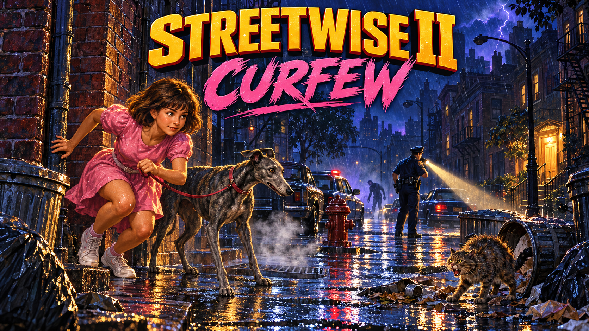

# Streetwise II: Curfew



**Play it in your browser: https://mtmangum.github.io/curfew/**

*Streetwise II: Curfew* is an isometric night stealth game in Godot 4. Nicole is out past curfew with her greyhound Stella, and has to sneak home across a big, patrolled neighbourhood without being seen.

## Run

1. Install [Godot](https://godotengine.org/) 4.3 or newer.
2. Open this folder (the one with `project.godot`) in Godot and press F5.

### In the browser

`./serve.sh` exports a web build to `build/web/` and serves it at http://localhost:8060 (use `./serve.sh --skip-export` to reuse the last build). It fills the browser tab and scales with the window. Web export needs Godot's export templates installed (Editor > Manage Export Templates).

The loading page shows a tip while the game builds. On a fast start it holds for a few seconds so the tip can be read; press a key or click to go sooner.

Music eases in over nine seconds, while the street ambience arrives sooner.

### Sprite gallery

Browse the [published sprite gallery](https://mtmangum.github.io/curfew/sprite-gallery.html), or open http://localhost:8060/sprite-gallery.html after running `./serve.sh`. It shows the game's PNG sprites, animation states, dimensions, original frames, and the level where each character first appears. The pieces the game draws in code are shown too, rendered from the game's own Godot drawing code: the rooftop air-conditioning cabinets, turning fans, water tank, and house roof; the tree grates and shop windows (with their neon signs); and the cop's alert marks, Stella's thought bubble, and the clue pictures.

The gallery also includes the five found-item icons. It includes search, pause and frame stepping, preview scale, animation speed, mirroring, and light/dark themes, with consistently sized controls in the toolbar and sprite cards. It is included automatically by `./deploy.sh`.

To preview only the gallery without Godot, run `python3 -m http.server 8060` from the project root and open the same URL. After adding or regenerating sprites, refresh its manifest with `python3 docs/tools/build_sprite_gallery.py`.

### Performance and memory checks

Run `python3 docs/tools/run_tests.py` for the headless regression checks. They cover gameplay, rooftop fading, scene/helper cleanup on real restarts, and audio-stream reuse. The test runner detects failed boolean checks and nonzero Godot exits.

The [October 4 performance audit](docs/audits/2026-10-04/REPORT.md) and [follow-up measurements](docs/audits/2026-10-04/followup/REPORT.md) include reproduction commands and remaining device checks. The fixes remove a builder reference cycle, cache depth keys without changing draw order, keep generated builds out of game packs, and reuse a bounded audio roster across retries. In the 20-restart Chrome probe, registered decoded audio fell from 661 MB to 31 MB after cleanup. Physical mobile devices and Safari still need validation.

## Controls

| Input | Action |
| --- | --- |
| Click / tap | Walk to that spot; hold and drag to keep steering toward the pointer |
| WASD / arrow keys | Move along the streets (each key follows one street direction) |
| Tab | Switch to screen-relative movement (W = screen up) |
| Shift (hold), or the Sneak button | Sneak: slower, quieter, harder to spot; the button toggles it on/off |
| F, or the Torch button on dark levels | Turn Nicole’s torch on/off |
| E, or tap the item slot | Use the found item you are carrying |
| H, or Stella, home? | Request a home hint; waits for Stella to finish her distraction and for safety, with a 30-second request cooldown |
| M | Show / hide the map |
| N, or Sound in the pause menu | Mute / unmute sound |
| P / Esc, or Pause / Resume buttons | Pause / carry on (it also pauses itself when you switch away) |
| C | Copy this session's playtest run log to the clipboard (for pasting into notes) |
| F3 | Playtest readout (sightings, chases, time, where you are) |
| R, or click / tap after the end banner | Try again (same house, you keep your map). After a win, or with Shift+R, a new neighbourhood |

The on-screen Sneak, Torch and Pause controls stay available during play below the map. Resume and Sound are available while paused. These controls scale up when the game canvas shrinks, and they disappear on the end screen so taps can reach the retry prompt.

## Design principle

This is a free browser game: players should understand what to do, recover from early mistakes, and earn a first win quickly. Level 1 introduces the dog, navigation and stealth with room to learn; later levels add pressure. Judge future features against [the playability principles](docs/DESIGN_PRINCIPLES.md), including avoiding long blind searches and stacking unfamiliar hazards.

The [first-level playability report](docs/qa/2026-10-04-first-level-playability.md) records the balance comparison, regression checks, deployment verification and remaining beginner playtesting needs.

The [broader playability and engagement audit](docs/audits/2026-10-04/playability/REPORT.md) records the level 2 transition, touch controls, guidance and tutorial findings, with prioritized actions and raw evidence. The [level 2 follow-up](docs/qa/2026-10-05-second-level-playability.md) records the gentler transition and patrol warning checks. The [navigation follow-up](docs/qa/2026-10-05-navigation.md) verifies requested hints, distraction priority, local detours and phone instructions.

## Levels

- **Level 1**, "Past Curfew", is a short first walk home: about one fifth of the patrols, more warning before a chase, slower cops you can outrun, at most two nearby cars, and no skateboarders or street people. Home is 1,400–2,200 units away and Stella gives scent hints every 8–14 seconds when she is free and safe. Phone booths fill in the map, and squirrels distract Stella. Skateboarders start on level 2.
- **Level 2**, "Cold Nose", is a gentler step into the blackout: 40% of patrols, five nearby cars, one skateboarder and hobos. Home is 2,200–4,200 units away; working phone booths remain and Stella offers scent hints every 10–15 seconds when free and safe. Patrols retain the first level’s reaction time, with slightly faster chases. Punks, zombies and lingering penalties wait until level 3; squirrels stop after level 1.
- **Level 3**, "Lights Out", introduces the full patrol roster, punks, zombies and lingering pressure, and removes working phone help. It adds rain (puddles, lightning, and a hush that makes every noise carry less far) and the dark: the world is nearly black except where a street light, a burn barrel, a cop's torch or your own torch lights it, so a building shows only where the light reaches. Nicole has a torch (F turns it on and off): it lights the way ahead and the walls it lands on, but cops see you the better for it. From this level **police cars** cruise the roads with their lights flashing; one that sees you chases you along the streets, turning corners after you, but it cannot leave the road, so a cop gets out and runs at you on foot when it reaches your kerb. Get off the road, out of its sight.
- **Level 4**, "The Pound", abandons the neighbourhood: boarded windows, graffiti, wrecked cars and quarantine barriers.
- **Level 5 and up**, "Neon Nose", is the red-light level: the boarded-up look gives way to neon. Pink, red, violet and cyan signs (BAR, CLUB, HOTEL, JAZZ and the like) light the dark streets in colour, the windows and fog glow pink, and the wet streets shine. People stand on the corners under the neon, and Stella wants to sniff every one of them: she stops for four seconds, with the leash holding you, which costs you time. (The same person will not stop her again for forty seconds, and they are no danger.)
- **Level 3 and up** keep turning it up. Getting home moves you to the next level in a new neighbourhood; losing means trying the same level again.

## How it plays

Get Nicole to the lit door of the house. Which house changes every run: it is nearby on level 1 and farther across the neighbourhood on later levels, and the map in the corner does not show it: you have to explore, and watch Stella. Every so often she catches the scent of home, lifts her head, sniffs and leads off that way for a few seconds with a gentle pull on the leash. The house only appears on the map once you have seen it. On levels 1 and 2, lit phone booths (a cyan handset bubble bobs over them; stand beside one for three seconds) fill in the map around them. After a lost run you try again for the same house, with the map you had explored (Shift+R for a new neighbourhood). Explore a city of avenues and side streets, past parked cars, traffic, steam vents, cats and cops.

- **Cops** patrol with flashlight cones. Standing in a cone builds suspicion until they give chase; you are caught only when a cop reaches you. They get suspicious faster the closer you are, and slower if you sneak. Walls block the beam. A yellow **?** means a cop is noticing you or investigating; a red **!** means he is after you. A prominent warning and suspicion bar show how close he is to starting a chase: leave the beam before the bar fills.
- **Stella** follows on a short leash and can be spotted too. If furniture blocks her following path, she walks around it; a taut leash briefly eases Nicole back to give her room. She notices cats nearby and lunges for them, hauling Nicole along behind her at nearly walking speed. Sneaking doesn't stop it, and being dragged is loud and easy to spot, so the best move is to steer clear of cats. When Stella reaches one she barks, which is loud and sends the cat running. (Her barks are real ones, cut from a recording of a dog.)
- **Footsteps** are audible at close range unless you sneak.
- **Cats** are smaller than Stella and wander to trash bins and knock them over. The crash makes noise, and cops go to investigate. Walk too close to a cat and it hisses and bolts, which is also noisy. A cat near a cop's route can pull them off it.
- **Life.** The bar at the top left drops when a car, skateboarder, punk, hobo or zombie gets you, and you are out when it is empty. Pizza slices on the pavement (by street lights) restore it, and keep adding past full into a neon-green overcharge. A cop catching you still ends the run at once. If a cop chases you and you keep ahead for about 8 seconds, he gives up.
- **Stella gets bored of cats.** She goes for a cat she notices, barking and hauling you along, but after about seven seconds she gives up and ignores cats for half a minute.
- **Stella knows the way home.** Now and then she catches the scent and leads toward a reachable next street, taking a local detour around obstacles. An overdue hint gets the next turn after her current distraction finishes; new animals cannot keep postponing it. The house bubble and direction arrow remain for four seconds after she stops leading. Tap **Stella, home?** or press **H** to request a hint (30-second request cooldown); it waits until she is free and safe, and cannot extend a hint already running. She stops hinting once you have found the house. The lead helps you choose the next street; it does not mark home or choose a safe route through patrols and traffic.
- **Stella is easily distracted.** She pees on fire hydrants (3.5 seconds rooted, and the leash holds you) and, if a squirrel bolts up a tree, chases it and barks up at the tree (loud) until it settles.
- **Trees** grow inside plazas, keeping the narrow sidewalks clear. Plaza trees retain their iron grates and squirrels.
- **Zombie hobos** (from level 3) shamble after you slowly. Keep moving: they cannot catch you if you do, and if you stand about, more turn up.
- **Clues.** The first time something happens that the game does not explain by itself (a cat knocking over a bin and drawing a cop, Stella catching the scent of home, a cop's ? or !, Stella hauling you after something, a zombie getting up), a card at the bottom of the screen says what it means. Each shows once, is remembered between visits (in your browser), and they stop after level 3. While Stella leads you toward home a little house floats over her head. Typing CLUES in the game brings the clues back.
- **Found items.** Treats, donut boxes, dark hoodies, fire extinguishers and cups of coffee lie about by the street lamps, a few kinds at a time (treats and donuts from level 1, hoodies and extinguishers from level 2, coffee from level 3). You carry one at a time (shown in the bottom-left corner) and use it with E. A dog treat makes Stella ignore cats, squirrels, hydrants and people on the corners for 30 seconds; a donut box put down draws cops who are not after you to stop and eat; the hoodie makes cops see you less far for 20 seconds; the extinguisher makes a white cloud that hides you for six seconds (but hisses); coffee makes you faster for eight seconds, but your steps are loud.
- **Buildings** go see-through when Nicole or Stella is behind one. What stands on a roof (air-conditioning units, some with slowly turning fans, and round wooden water tanks) fades out much more, and anything that would show up over the street behind the building (the tall water tanks) disappears altogether, so it never looks like clutter in the road.
- **Steam vents** cycle on and off. A short puff warns that one is about to blow. While venting, the cloud blocks sight lines, so standing in it hides you.
- **Trash fires** light up anyone nearby, making you easier to spot.

## Project layout

```
project.godot
scenes/Main.tscn   a single node; the level is built in code
scripts/
  Main.gd          the hub: world lists, boot, camera, noise, line of sight, win/lose
  AudioDirector.gd DepthSorter.gd Hud.gd          sound and music, draw order, the heads-up display
  LevelBuilder.gd FurnitureBuilder.gd LevelData.gd  build the city from plain data
  Player.gd Dog.gd Cop.gd Cat.gd Squirrel.gd StreetNpc.gd Skater.gd Car.gd   the cast
  Building.gd Roofs.gd RoofProps.gd RoofFan.gd   buildings and their rooftops (units, tanks, turning fans)
  LevelSettings.gd LevelLook.gd    what each level is like, and how it looks
  ActivityGate.gd  switches off what is far from the action
  Sprites.gd       sprite loading and drawing helpers
assets/
  sprites/         pixel art rendered from the Streetwise sidescroller
  audio/           sounds and music, synthesised, plus Stella's real barks
```

The level is plain data in `LevelData.gd` (building rects, cop routes, vent and bin positions), so it's easy to rearrange.

## Level design toolbox

Sprites for more night hazards from Streetwise are already in `assets/sprites/` and ready to become mechanics: `rats` (scurry and spook) and `boombox` (noise that masks footsteps). More, like the sleeping bystander, can be pulled from the sidescroller.

## Development

See [docs/HANDOFF.md](docs/HANDOFF.md) for the code map, how to run the headless checks in `docs/tools/`, how the sprites and sounds are generated, and the to-do list.

The art is generated from the procedural pixel art of the Streetwise sidescroller (a sibling project), so there are no hand-made image files to edit.

Version history is in [CHANGELOG.md](CHANGELOG.md). Fonts: [Pixelify Sans](https://fonts.google.com/specimen/Pixelify+Sans) and [Silkscreen](https://fonts.google.com/specimen/Silkscreen), both under the SIL Open Font License (see `assets/fonts/`).
